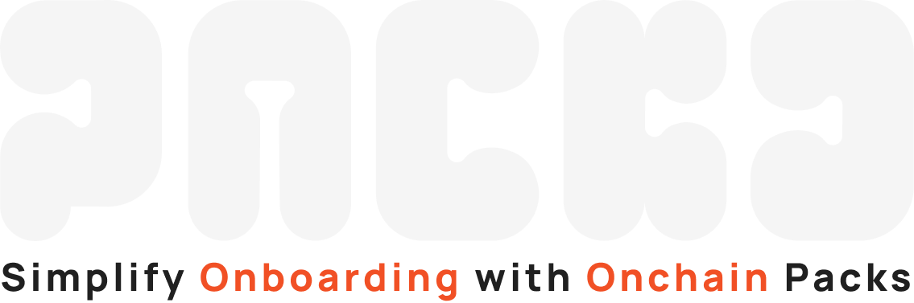

# Packs Main Repo

PACKD is a web3 project that introduces a new way of sharing and receiving digital assets.

Users can create packs, which are essentially NFTs that own their own accounts. These packs can be filled with various digital assets, including tokens, NFTs, and some ETH to cover gas fees.

Once a pack is created, the user receives a link that can be shared through any platform. The recipient of the pack can open it without worrying about gas fees, as the pack pays for its own unpacking.

This makes PACKD an ideal tool for onboarding new users into the ecosystem, as it eliminates the need for them to go through a centralized exchange, KYC, or bridge or acquire ETH. Other use cases include sending onchain gifts, onchain merch drops (share a claim link as a QR code), NFT drops via email for newsletter readers, loot boxes for games etc.

## How it works

The core of PACKD is built using Solidity smart contracts. We utilized the ERC721 standard to create the packs as NFTs. However, we extended this functionality with the ERC6551 standard, which allows these NFTs to own their own accounts. This unique feature enables each pack to act as a mini-wallet, holding various digital assets and even paying for its own gas fees. The contracts are designed to be modular, currently supporting ERC721 and ERC20 assets, but they can be extended to support more complex use cases and logic in the future with additional modules, see `packages/contracts/contracts/modules` for more details.

## Project Structure

The project is split into 2 packages:

- `contracts`: contains the smart contracts
- `app`: contains the frontend app including the Relayer

## Local Hardhat Node Setup

### Setup

Change directory to the contracts folder:

```bash
cd packages/contracts
```

Install dependencies if not already installed:

```bash
yarn install
```

Make a .env file , take as example `packages/contracts/.env.example`
Set up within the file the accounts used on development mode ACCOUNT_N

Configure the level of logs verbosity with either of the following commands

```bash
export DEBUG=packd:log*
export DEBUG=packd:info*
```

The full details of how npm debug package works can be found [here](https://github.com/debug-js/debug)

### Start Dev environment single command

It starts a local hardhat node, deploy all mock dependencies, deploy all contracts, mint some ERC20 and ERC721, and send some ETH to all the ACCOUNT_N addresses configured on the .env file.

```bash
yarn start:dev
```

### Step by step setup

Start a local hardhat node.

```bash
yarn start
```

Keep this terminal open and running.

In a new terminal, same directory, deploy the contracts:

```bash
yarn deploy
```

**Note down the address of the deployed contract, you will need it later.**

### Fund Account with ETH

To send some ETH to your account, run the hardhat task:

```bash
yarn task send:eth --account 0x....01 --amount 1 --network localhost
```

Replace the account with your own, and the amount with the desired amount.

### Mint Test Tokens

To mint some test ERC20 tokens, run the hardhat task:

```bash
yarn task mint:erc20 --account 0x....01 --tokenaddress 0x....02 --amount 1000 --network localhost
```

Replace the account with your own, and the tokenaddress with the address of the deployed ERC20 contract. Amount is optional, default is 1000.

### Mint Test NFTs

To mint some test ERC721 token, run the hardhat task:

```bash
yarn hardhat mint:erc721 --account 0x....01 --tokenaddress 0x....02 --tokenid 0 --network localhost
```

Replace the account with your own, and the tokenaddress with the address of the deployed ERC721 contract. Tokenid is optional, default is 0. Increment it to mint more tokens.

## DEV NOTES

To generate frontend hooks run on the app folder:

```bash
yarn generate
```

Please commit types
